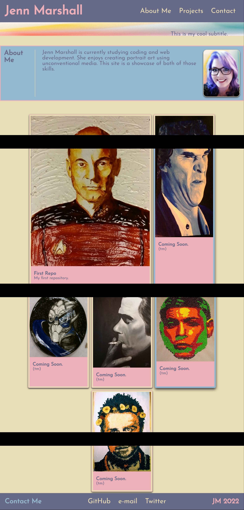

# Jenn Marshall's Portfolio Site

## Description

This project created a portofio page to showcase my work built from the ground up using HTML and CSS. It is a showcase of what I have learned in the first 2 weeks of coding bootcamp. The CSS utilizes flexbox and variables for style and positioning. I intend to build this page further with the additional skills I learn from this class. The link to the deployed site is below:

https://jennnmarshall.github.io/portfolio

## Installation

N/A

## Usage

This page is designed to showcase my work as a web developer and designer. The project showcases, as they become populated, will link to projects that I have completed in class and beyond. 

## Credits

Jenn Marshall, 2022.

## License

Please refer to the license in the repo.
